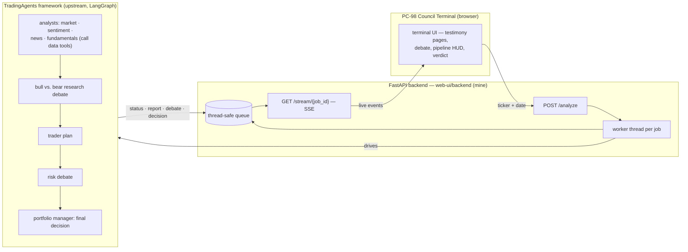

# Trading Agents — PC-98 Council Terminal

[](https://github.com/zachthebird/council-terminal/actions/workflows/ci.yml)
[](LICENSE)

Multi-agent trading systems are powerful but opaque: a dozen LLM calls happen and a decision falls out. This is a **retro PC-98 anime terminal** for the [TradingAgents](https://github.com/TauricResearch/TradingAgents) framework — summon an eight-agent council for any ticker, watch the analysts report, the bull and the bear argue it out, and the judge rule **BUY / SELL / HOLD**, all streamed live into a CRT-styled terminal you can actually read.

> **🔴 Live demo:** **[zachbird.com/tradingAgentsGUI](https://zachbird.com/tradingAgentsGUI/)** — a genuine recorded council session (AAPL) replayed through the real terminal: no backend, no API keys, clearly labeled on-screen. Self-hosted with the backend below, the same terminal runs live analyses streamed over SSE. Demo source: [`web-ui/static-demo/terminal/`](web-ui/static-demo/terminal/).

> Public export of my working repository (history squashed; trading run outputs excluded). Earlier UI experiments — a character-driven "Bazaar" / Round Table theme and a Game Boy edition — still live in the tree, but the PC-98 terminal is the one I ship.

## What's mine vs. what's upstream

| Layer | Author |
|---|---|
| `web-ui/` — FastAPI + SSE backend, the **PC-98 Council Terminal** UI, recorded-session demo (plus earlier Bazaar / Round Table / Game Boy skins over the same backend) | **me** |
| `ui-alternatives/` — three earlier UI concepts (command bridge, agent council, pulse) | **me** |
| `tradingagents/`, `cli/`, `tests/`, `CHANGELOG.md` — the agent framework itself | [TauricResearch/TradingAgents](https://github.com/TauricResearch/TradingAgents) (Apache-2.0) |

The interesting engineering problem here was the seam between the two: the upstream pipeline is a synchronous LangGraph generator, and the UI needs live token-by-token progress in a browser.

## How it works

Each `/analyze` request spawns a worker thread that drives the synchronous LangGraph pipeline; events are pushed onto a thread-safe queue, and the SSE endpoint drains that queue via `run_in_executor` so the async event loop never blocks. The browser consumes one `EventSource` stream and routes each event type to a persona.



In the framework (upstream's design): four analysts gather evidence by calling market-data tools, bull/bear researchers debate it, a trader drafts the plan, a risk team stress-tests it, and a portfolio-manager agent makes the final call. The terminal seats all eight as a distinct PC-98 anime cast — market, sentiment, news and fundamentals analysts; a bull and a bear researcher; a trader; a risk warden; and the high judge who delivers the verdict — each with its own portrait and speaking frames.

## Run it

```bash
# 0) Python 3.10+. Install framework + backend deps:
pip install -r requirements.txt
pip install -r web-ui/backend/requirements.txt

# 1) Configure: set at least one LLM provider key
cp .env.example .env   # then edit .env

# 2) Start the API server (port 8000)
cd web-ui/backend && python main.py

# 3) In a second terminal, serve the frontends (port 8081)
cd web-ui/frontend && python3 -m http.server 8081
# then open the PC-98 terminal UI in your browser
```

The UI talks to `http://localhost:8000` by default; append `?api=http://other-host:8000` to point elsewhere. Backend endpoints, SSE event schema, and optional auth (`TRADINGAGENTS_API_TOKEN`) are documented in [`web-ui/backend/README.md`](web-ui/backend/README.md). To preview the no-backend recorded session locally, serve [`web-ui/static-demo/terminal/`](web-ui/static-demo/terminal/) the same way.

## Stack

Python · FastAPI · Server-Sent Events · LangGraph (upstream framework) · React 18 (CDN, no build step) · vanilla CSS/SVG character art · Vercel (static demo hosting)

## Evaluation

There's a reproducible eval/backtest harness in [`evals/`](evals/): it runs the agents over a fixed set of past decisions, maps each 5-tier rating to a position, and scores it against the realized forward return — directional hit-rate, signal-weighted return and alpha vs. a buy-and-hold baseline, rating distribution, and cost/latency, all with caveats. The metric math is unit-tested, and a `--mock` mode runs the whole pipeline for free.

Honest status: **the harness exists; I have not published a real run yet.** No performance numbers are claimed anywhere (the public demo is a scripted replay, clearly labeled). [`evals/RESULTS.md`](evals/RESULTS.md) stays a placeholder until a real run fills it — fabricating results would defeat the entire point. The biggest open validity question is point-in-time data: until the framework's data tools are confirmed strictly as-of-date, any results would be **invalid (lookahead bias), not merely noisy** — called out plainly in the eval README. Treat this repo as an orchestration and UX layer over a research framework, now with the scaffolding to measure it honestly.

## Limitations / what I'd do next

- **Eval harness has no published run yet** — the scaffolding is in `evals/`; the next step is a real run over a pre-registered, unbiased case set, after confirming the data tools are strictly point-in-time.
- **Prototype-grade frontend** — React via CDN + Babel standalone, no build pipeline or tests; fine for a prototype, not production.
- **Single-machine job model** — analyses run as in-process threads; restarting the server orphans running jobs. A real deployment wants a job queue and persistence.
- **Costs real money to run live** — each full analysis makes many LLM calls; the framework supports cheaper providers (DeepSeek, local Ollama) to soften this.
- Three names appear in this project's history (TradingAgentsGUI → The Bazaar → Round Table theme); the repo standardizes on **The Bazaar** with Round Table as a visual theme.

> Built on [TauricResearch/TradingAgents](https://github.com/TauricResearch/TradingAgents). TradingAgents is designed for research purposes; nothing here is financial, investment, or trading advice.
