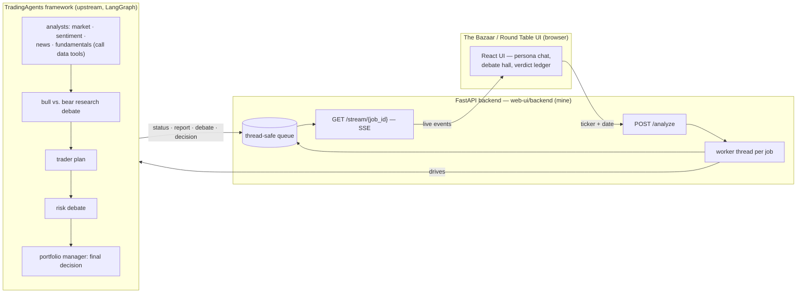

# The Bazaar — a character-driven GUI for a multi-agent LLM trading framework

Multi-agent trading systems are powerful but opaque: a dozen LLM calls happen and a decision falls out. **The Bazaar** puts a face on every agent in the [TradingAgents](https://github.com/TauricResearch/TradingAgents) framework — summon an analyst team for any ticker, watch the bull and the bear actually argue it out live, and get a verdict you can interrogate. Built for anyone who wants to *see* how a multi-agent pipeline reasons, not just read its final answer.

> **🔴 Live demo:** [static-demo-gules.vercel.app](https://static-demo-gules.vercel.app) — the *Traders of the Round Table* council debate. It replays canned data (no backend, no API keys) so you can feel the UX in ten seconds; the page says so on-screen. Demo source: [`web-ui/static-demo/`](web-ui/static-demo/). When self-hosted with the backend below, the same UI runs real analyses streamed live over SSE.

> This is a public export of my working repository (history squashed; trading run outputs excluded).

## What's mine vs. what's upstream

| Layer | Author |
|---|---|
| `web-ui/` — FastAPI + SSE backend, **The Bazaar** UI, **Round Table** castle theme, static demo | **me** |
| `ui-alternatives/` — three earlier UI concepts (command bridge, agent council, pulse) | **me** |
| `tradingagents/`, `cli/`, `tests/`, `CHANGELOG.md` — the agent framework itself (v0.2.5) | [TauricResearch/TradingAgents](https://github.com/TauricResearch/TradingAgents) (Apache-2.0) |

The interesting engineering problem here was the seam between the two: the upstream pipeline is a synchronous LangGraph generator, and the UI needs live token-by-token progress in a browser.

## How it works

Each `/analyze` request spawns a worker thread that drives the synchronous LangGraph pipeline; events are pushed onto a thread-safe queue, and the SSE endpoint drains that queue via `run_in_executor` so the async event loop never blocks. The browser consumes one `EventSource` stream and routes each event type to a persona.



In the framework (upstream's design): four analysts gather evidence by calling market-data tools, bull/bear researchers debate it, a trader drafts the plan, a risk team stress-tests it, and a portfolio-manager agent makes the final call. Each one is a persona in the UI:

| # | Character | Role | Color | Avatar |
| --- | --- | --- | --- | --- |
| 1 | Flint | Market Analyst | #8B6B4A | Bull |
| 2 | Vera | Sentiment Analyst | #C44B4B | Crystal |
| 3 | Reed | News Analyst | #4B7A9E | Scroll |
| 4 | Sage | Fundamentals Analyst | #5C8A6F | Chart |
| 5 | Balthazar | Investment Debater | #D4A030 | Scales |
| 6 | Morwen | Risk Debater | #7B8B9A | Shield |
| 7 | Kael | Trader | #C07840 | Runner |
| 8 | Elder Aldric | Judge | #9B8BAA | Crown |

Design notes for the Bazaar UI live in [`web-ui/frontend/the-bazaar/README.md`](web-ui/frontend/the-bazaar/README.md); the castle theme pack is documented in [`README-castle.md`](web-ui/frontend/the-bazaar/README-castle.md).

## Run it

```bash
# 0) Python 3.10+. Install framework + backend deps:
pip install -r requirements.txt
pip install -r web-ui/backend/requirements.txt

# 1) Configure: set at least one LLM provider key
cp .env.example .env   # then edit .env

# 2) Start the API server (port 8000)
cd web-ui/backend && python main.py

# 3) In a second terminal, serve the frontends (port 8081)
cd web-ui/frontend && python3 -m http.server 8081
# open http://localhost:8081/the-bazaar/
```

The UI talks to `http://localhost:8000` by default; append `?api=http://other-host:8000` to point elsewhere. Backend endpoints, SSE event schema, and optional auth (`TRADINGAGENTS_API_TOKEN`) are documented in [`web-ui/backend/README.md`](web-ui/backend/README.md). To preview the no-backend demo locally, serve `web-ui/static-demo/` the same way.

## Stack

Python · FastAPI · Server-Sent Events · LangGraph (upstream framework) · React 18 (CDN, no build step) · vanilla CSS/SVG character art · Vercel (static demo hosting)

## Evaluation

Honest status: **no formal evaluation yet.** Nothing here measures whether the agents' trading judgments are any good — the public demo is a scripted replay, clearly labeled as such, and no performance numbers are claimed anywhere. The next piece of work is a reproducible eval/backtest harness (fixed historical window, agents vs. a buy-and-hold baseline, hit-rate and cost/latency reported with caveats). Until that exists, treat this as what it is: an orchestration and UX layer over a research framework.

## Limitations / what I'd do next

- **No eval harness yet** — see above; it's the top of the list.
- **Prototype-grade frontend** — React via CDN + Babel standalone, no build pipeline or tests; fine for a prototype, not production.
- **Single-machine job model** — analyses run as in-process threads; restarting the server orphans running jobs. A real deployment wants a job queue and persistence.
- **Costs real money to run live** — each full analysis makes many LLM calls; the framework supports cheaper providers (DeepSeek, local Ollama) to soften this.
- Three names appear in this project's history (TradingAgentsGUI → The Bazaar → Round Table theme); the repo standardizes on **The Bazaar** with Round Table as a visual theme.

> Built on [TauricResearch/TradingAgents](https://github.com/TauricResearch/TradingAgents). TradingAgents is designed for research purposes; nothing here is financial, investment, or trading advice.
